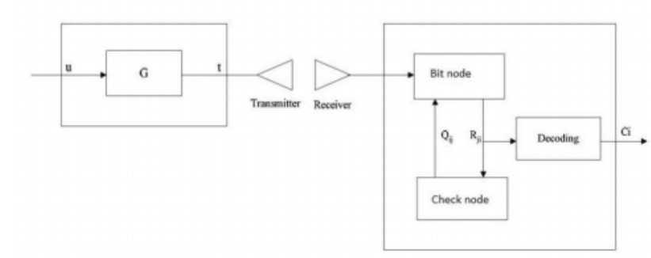
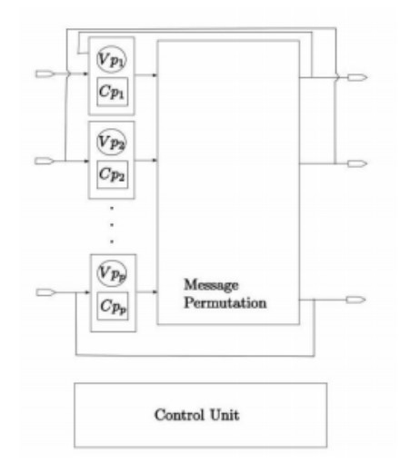

# ldpc-encoder-decoder
[Encoding and Decoding](images/encoder.jpg)
 
[Decoder](images/decoder.jpg)

- In information theory, a Low-Density Parity-Check (LDPC) code is a linear error correcting code, a method of transmitting a message over a noisy transmission channel. 
- An LDPC is constructed using a sparse Tanner graph (subclass of the bipartite graph). LDPC codes are capacity-approaching codes, which means that practical constructions exist that allow the noise threshold to be set very close to the theoretical maximum (the Shannon limit) for a symmetric memoryless channel.  
- The noise threshold defines an upper bound for the channel noise, up to which the probability of lost information can be made as small as desired.  Using iterative belief propagation techniques, LDPC codes can be decoded in time linear to their block length. LDPC codes are finding increasing use in applications requiring reliable and highly efficient information transfer over bandwidth-constrained or return-channel-constrained links in the presence of corrupting noise. LDPC (Low Density Parity Check) is used for PDSCH and PUSCH.  
- Low density parity check (LDPC) codes are linear block codes used for error detection and correction mostly in high speed digital communication systems like digital broadcasting, optical fibre communications and wireless local area networks. LDPC codes have been subject to extensive research because of their significant performance in error correction. 
- LDPC Code is a type of Block Error Correction code discovered and performance very close to Shanon’s limit .Good error correcting performance enables reliable communication. Since its discovery by Gallagar there is more research going on for its efficient construction and implementation. Though there is no unique method for constructing LDPC codes. Implementation of LDPC Code is done by taking different factors into consideration such as error rate, parallelism of decoder, ease in implementation etc.  
- This mini-project work undertaken by us involves the simulation of LDPC encoding/decoding using Matlab, Generating Verilog/VHDL code for the hardware implementation of LDPC encoding/decoding using tools like Matlab or Python .Testing and verification of the results in suitable hardware.  
- In this mini-project we as a team are exploring different fields of electronics using a single mini-project which has simulation, hardware and software parts. 
- Looking back over the last six decades or so, one can reasonably surmise that the family of low-density parity-check codes (LDPC) and that of turbo codes, constitute the two most practical realizations of Shannon’s theory, which have revolutionized the field of error correction coding. 
- Shannon demonstrated that it is possible to transmit information arbitrarily reliably over any unreliable channel, provided that the information transmission rate is lower than the capacity of the channel. Therefore, the channel capacity sets the bound on how much information we can transmit over a channel. Shannon’s claim can be realized by a technique referred to as forward error correction. 
- The basic idea is that of incorporating redundant bits, or check bits, thus creating what is known as a codeword. If the check bits are introduced in an “appropriate manner” so as to make each codeword sufficiently distinct from each other, the receiver will then become capable of determining the most likely codeword that has been transmitted. The channel capacity will determine the exact amount of redundancy that has to be incorporated by the encoder in order to be able to correct the errors imposed by the channel. However, Shannon’s theory only quantifies the maximum attainable rate, but refrains from specifying the means of achieving it. This triggered widespread research efforts resulting in diverse extensions, deeper interpretations and practical realizations of Shannon’s original work, which reached its pinnacle in the definition of LDPC and turbo codes. 
Today LDPC are used for 10GBASET Ethernet, which sends 10 gigabits per second over twisted pair cables, LDPC are a part of WiFi 802.11, 802.11n and 802.11ac in High Throughput (HT) PHY specification in 5G. 
- LDPC codes, with iterative decoding, have been shown to achieve excellent performance over many channels, nearly approaching capacity on additive white Gaussian noise (AWGN) channel, and as code's length tends to infinity, achieving it on the binary erasure channel (BEC). 
- In this project as a continuation of the CRC project from the 5th sem, we are trying to implement LDPC encoding or decoding. 
